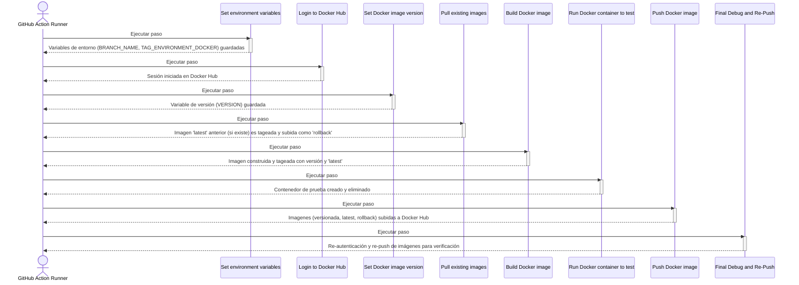

# Push to Docker Hub Action

## Idiomas
- [Ingles](README.md)
- [Español](README.es.md)

### 📘 1. ¿Qué hace esta Action?

Esta GitHub Action automatiza el proceso de construir una imagen de Docker y publicarla en Docker Hub. Su propósito principal es estandarizar el despliegue continuo (CI/CD) asociando ramas de Git específicas con etiquetas de entorno en Docker.

El flujo de trabajo es el siguiente:

1. **Determina el entorno:** Identifica la rama de Git que activó el workflow (ej. main, development) y la mapea a una etiqueta de entorno (ej. prod, dev) usando un mapa JSON configurable. Si la rama no está en el mapa, la Action falla.

2. **Genera una versión única:** Crea una etiqueta de versión única para la imagen de Docker basada en la fecha y hora UTC actual (ej. 20231027T153000Z).

3. **Gestiona el rollback:** Antes de construir la nueva imagen, intenta descargar la imagen latest existente del entorno correspondiente. Si la encuentra, la re-etiqueta como rollback y la sube a Docker Hub, conservando así una versión anterior para posibles restauraciones.

4. **Construye y prueba la imagen:** Construye la nueva imagen de Docker a partir de un Dockerfile específico. Una vez construida, la etiqueta con la versión única y también como latest. Realiza una prueba rápida (smoke test) iniciando un contenedor a partir de la imagen y eliminándolo inmediatamente para verificar que no falle al arrancar.

5. **Publica en Docker Hub:** Sube a Docker Hub la imagen con su etiqueta de versión única, la etiqueta latest del entorno y la etiqueta rollback (si fue creada).

Esta Action es ideal para repositorios que utilizan una estrategia de ramas por entorno (GitFlow o similar) y necesitan un proceso automatizado y consistente para sus despliegues en Docker Hub.

### ⚙️ 2. Inputs Requeridos

A continuación se detallan los parámetros de entrada que la Action utiliza:

| Nombre del input | ¿Requerido? | Valor por defecto | Descripción técnica |
|-----------------|-------------|-------------------|-------------------|
| `dockerhub-username` | ✅ | N/A | El nombre de usuario para autenticarse en Docker Hub |
| `dockerhub-password` | ✅ | N/A | La contraseña o token de acceso para autenticarse en Docker Hub |
| `dockerhub-repository` | ✅ | N/A | El nombre del repositorio en Docker Hub donde se publicará la imagen (ej. mi-usuario/mi-app) |
| `branch-environment-map` | ❌ | `{"main": "prod", "development": "dev", "staging": "stg", "testing": "tst"}` | Un objeto JSON que mapea los nombres de las ramas de Git a las etiquetas de entorno de Docker |
| `dockerfile-path` | ❌ | `deployments/Dockerfile.deploy` | La ruta relativa al Dockerfile que se utilizará para construir la imagen |

### 📈 3. Diagrama secuencial paso a paso

El siguiente diagrama ilustra el flujo de ejecución de la Action, desde la configuración inicial hasta la publicación final de la imagen.



### 🧠 4. Algoritmo detallado

A continuación se describe el proceso que realiza la Action, paso por paso:

#### Set environment variables (Establecer variables de entorno)

1. Extrae el nombre de la rama actual de la variable de entorno `GITHUB_REF` y lo guarda en `BRANCH_NAME`.
2. Lee el input `branch-environment-map` (un string JSON) y utiliza la utilidad `jq` para encontrar el valor asociado a la clave `BRANCH_NAME`. El resultado se guarda en `TAG_ENVIRONMENT_DOCKER`.
3. **Condición:** Si no se encuentra una correspondencia para la rama en el mapa (`TAG_ENVIRONMENT_DOCKER` es nulo o vacío), el script falla con un código de error 1.
4. Exporta las variables `BRANCH_NAME` y `TAG_ENVIRONMENT_DOCKER` al entorno de GitHub (`$GITHUB_ENV`) para que estén disponibles en los siguientes pasos.

#### Debug Environment Variables (Depurar variables de entorno)

- Imprime los valores de las variables `TAG_ENVIRONMENT_DOCKER` y `BRANCH_NAME` para fines de depuración.

#### Login to Docker Hub (Iniciar sesión en Docker Hub)

1. Utiliza la action predefinida `docker/login-action@v2`.
2. Se autentica en Docker Hub utilizando los inputs `dockerhub-username` y `dockerhub-password`.

#### Set Docker image version (Establecer la versión de la imagen Docker)

1. Genera una cadena de texto con la fecha y hora UTC actual en formato `YYYYMMDDTHHMMSSZ` y la guarda en la variable `DATE_UTC`.
2. Exporta esta cadena como la variable `VERSION` al entorno de GitHub (`$GITHUB_ENV`).

#### Debug Docker Version (Depurar la versión de Docker)

- Imprime el valor de la variable `VERSION`.

#### Pull existing images (Descargar imágenes existentes)

1. Ejecuta el comando `docker pull` para intentar descargar la imagen con la etiqueta latest del entorno actual (ej. `mi-repo:prod-latest`).
2. **Condición (Éxito):** Si la imagen se descarga correctamente:
   - La re-etiqueta con el sufijo `-rollback` (ej. `mi-repo:prod-rollback`).
   - Sube esta nueva imagen rollback a Docker Hub con `docker push`.
3. **Condición (Fallo):** Si no existe una imagen latest, el comando falla y se muestra un mensaje indicando que no hay imagen para usar como rollback.

#### Build Docker image (Construir la imagen de Docker)

1. Define el nombre completo de la nueva imagen usando el repositorio, el tag de entorno y la versión (`${{ inputs.dockerhub-repository }}:${TAG_ENVIRONMENT_DOCKER}-${VERSION}`) y lo guarda en `IMAGE_NAME`.
2. Exporta `IMAGE_NAME` al entorno de GitHub (`$GITHUB_ENV`).
3. Ejecuta `docker build` usando el Dockerfile especificado en `dockerfile-path`.
4. Etiqueta la imagen recién construida con el `IMAGE_NAME` completo.
5. Adicionalmente, la etiqueta también como `-latest` para el entorno actual (ej. `mi-repo:prod-latest`).

#### Debug Build Info (Depurar información de la construcción)

1. Imprime el valor de `IMAGE_NAME`.
2. Ejecuta `docker images` para listar todas las imágenes de Docker presentes en el runner.

#### Run Docker container to test (Ejecutar contenedor para probar)

1. Ejecuta `docker run` en modo desacoplado (`-d`) para iniciar un contenedor llamado `test_container` a partir de la imagen recién construida (`$IMAGE_NAME`).
2. Lista todos los contenedores (`docker ps -a`) para verificar su estado.
3. Inmediatamente después, detiene forzosamente y elimina el `test_container` con `docker rm -f`.

#### Push Docker image (Subir la imagen de Docker)

1. Ejecuta `docker push` para subir la imagen con la etiqueta de versión única (`$IMAGE_NAME`).
2. Ejecuta `docker push` para subir la imagen con la etiqueta `-latest` del entorno.
3. **Condición:** Verifica si una imagen con la etiqueta `-rollback` existe localmente. Si es así, la sube a Docker Hub.

#### Debug Info (Información de depuración)

1. Imprime de nuevo el valor de `IMAGE_NAME`.
2. Lista todas las imágenes de Docker locales.
3. Realiza un segundo `docker login` con las mismas credenciales.
4. Vuelve a ejecutar `docker push` para la imagen con versión y la imagen latest como una medida de verificación final.

### 🚀 5. Ejemplos de Uso

Aquí se muestran configuraciones de ejemplo para diferentes escenarios.

#### Ejemplo 1: Despliegue en Producción desde la Rama main

Este ejemplo muestra cómo configurar el workflow para que, al hacer un push a la rama main, se construya y publique una imagen en el entorno de producción (prod).

##### Configuración del Workflow
```yaml
name: Deploy to Production
on:
  push:
    branches:
      - main
jobs:
  build-and-push:
    runs-on: ubuntu-latest
    steps:
      - name: Checkout repository
        uses: actions/checkout@v3

      - name: Push to Docker Hub
        uses: ronihdzz/push-to-dockerhub-action@v2
        with:
          dockerhub-username: ${{ secrets.DOCKERHUB_USERNAME }}
          dockerhub-password: ${{ secrets.DOCKERHUB_TOKEN }}
          dockerhub-repository: ${{ secrets.DOCKERHUB_REPOSITORY }}
```

##### Explicación del Comportamiento

- **Activador**: El workflow se ejecuta cuando hay un push a la rama main.

- **Inputs Utilizados**:
  - `dockerhub-username` y `dockerhub-password`: Se obtienen de los secrets del repositorio para una autenticación segura.
  - `dockerhub-repository`: Se obtiene del secret `DOCKERHUB_REPOSITORY` para no exponer el nombre del repositorio directamente en el código.
  - `branch-environment-map`: Se utiliza el valor por defecto. La Action mapeará la rama main al entorno prod.
  - `dockerfile-path`: Se usará la ruta por defecto: `deployments/Dockerfile.deploy`.

- **Resultado**: La Action construirá una imagen y la publicará en el repositorio definido en `secrets.DOCKERHUB_REPOSITORY` con las siguientes etiquetas:
  - `prod-latest` (la imagen más reciente para producción)
  - `prod-YYYYMMDDTHHMMSSZ` (una etiqueta de versión única)
  - `prod-rollback` (si existía una imagen prod-latest anterior)

#### Ejemplo 2: Despliegue en Desarrollo con un Dockerfile Personalizado

En este escenario, queremos desplegar en el entorno de desarrollo (dev) desde la rama development y usar un Dockerfile ubicado en una ruta no estándar.

##### Configuración del Workflow
```yaml
name: Deploy to Development
on:
  push:
    branches:
      - development
jobs:
  build-and-push-dev:
    runs-on: ubuntu-latest
    steps:
      - name: Checkout repository
        uses: actions/checkout@v3

      - name: Push to Docker Hub (Dev)
        uses: ronihdzz/push-to-dockerhub-action@v2
        with:
          dockerhub-username: ${{ secrets.DOCKERHUB_USERNAME }}
          dockerhub-password: ${{ secrets.DOCKERHUB_TOKEN }}
          dockerhub-repository: ${{ secrets.DOCKERHUB_REPOSITORY }}
          dockerfile-path: 'build/dev/Dockerfile'
```

##### Explicación del Comportamiento

- **Activador**: El workflow se ejecuta con cada push a la rama development.

- **Inputs Utilizados**:
  - Se proporcionan las credenciales desde los secrets.
  - `dockerhub-repository`: También se obtiene de los secrets del repositorio, manteniendo la consistencia.
  - `branch-environment-map`: Se usa el valor por defecto. La Action mapeará correctamente la rama development al entorno dev.
  - `dockerfile-path`: Se sobrescribe el valor por defecto para apuntar a `build/dev/Dockerfile`.

- **Resultado**: La Action utilizará el Dockerfile especificado para construir la imagen. Luego, la publicará en el repositorio de Docker Hub definido en los secrets con las etiquetas `dev-latest`, `dev-YYYYMMDDTHHMMSSZ` y, potencialmente, `dev-rollback`. 