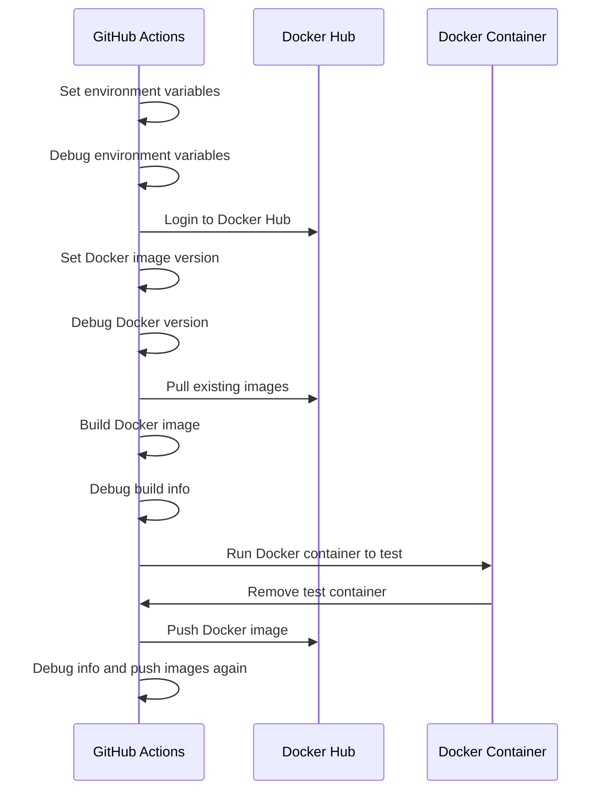

# Push to Docker Hub GitHub Action

## Description

This GitHub Action pushes a Docker image to Docker Hub. It also handles tagging and versioning of the Docker image based on the branch and environment.

## Inputs

- `dockerhub-username` (required): The Docker Hub username needed to authenticate and push the Docker image.
- `dockerhub-password` (required): The Docker Hub password needed to authenticate and push the Docker image.
- `dockerhub-repository` (required): The Docker Hub repository where the Docker image will be pushed.

## Environment Variables

- `GH_TOKEN`: Required for GitHub authentication. This is a secret input and should be provided as a GitHub Actions secret.
- `BRANCH_NAME`: The current branch name. This value is automatically obtained from the GitHub Actions context.
- `ENVIRONMENT`: The environment determined based on the branch name (`production` for `main`, `development` for `development`, `staging` for `staging`).
- `VERSION`: The Docker image version set to the current UTC date and time.

## Steps

1. **Set environment variables**: Determines the `BRANCH_NAME` and sets the `ENVIRONMENT` variable based on the branch name.
2. **Debug environment variables**: Prints the `ENVIRONMENT` and `BRANCH_NAME` to the console for debugging purposes.
3. **Login to Docker Hub**: Authenticates with Docker Hub using the provided credentials.
4. **Set Docker image version**: Sets the `VERSION` variable to the current UTC date and time.
5. **Debug Docker version**: Prints the `VERSION` to the console for debugging purposes.
6. **Pull existing images**: Pulls the existing Docker image for the environment and tags it as `rollback` if it exists.
7. **Build Docker image**: Builds the Docker image and tags it as the current version and latest.
8. **Debug build info**: Prints information about the built Docker image.
9. **Run Docker container to test**: Runs a Docker container to test the built image and then removes the test container.
10. **Push Docker image**: Pushes the Docker image to Docker Hub with the current version, latest, and rollback tags if applicable.
11. **Debug info**: Prints additional debug information and pushes the images again for verification.

## Sequence Diagram




## Usage Example

```
name: CI

on:
  push:
    branches:
      - main
      - development
      - staging
  pull_request:
    branches:
      - main
      - development
      - staging

jobs:
  push-docker-hub:
    runs-on: ubuntu-latest
    steps:
      - name: Checkout code
        uses: actions/checkout@v3

      - name: Run Push to Docker Hub Action
        uses: ronihdzz/push-to-dockerhub-action@main
        with:
          dockerhub-username: ${{ secrets.DOCKERHUB_USERNAME }}
          dockerhub-password: ${{ secrets.DOCKERHUB_PASSWORD }}
          dockerhub-repository: ${{ vars.DOCKERHUB_REPOSITORY }}
```

## Notes

* Ensure you add `DOCKERHUB_USERNAME` and `DOCKERHUB_PASSWORD` as secrets in your GitHub repository settings.
* This workflow uses Docker to build and push images, so Docker must be installed and configured on the GitHub Actions runner.