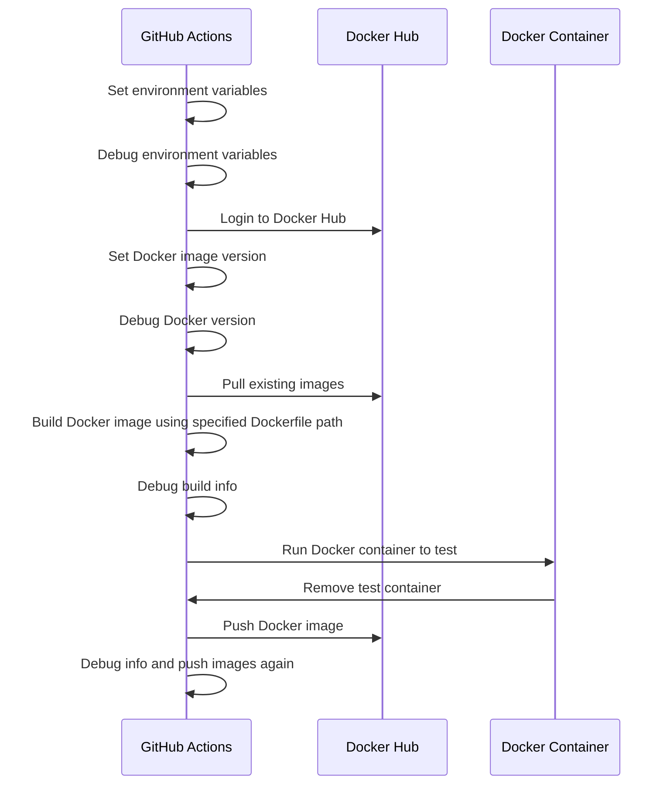

# Push to Docker Hub GitHub Action

## Description

This GitHub Action pushes a Docker image to Docker Hub. It also handles tagging and versioning of the Docker image based on the branch and environment.

## Inputs

- `dockerhub-username` (required): The Docker Hub username needed to authenticate and push the Docker image.
- `dockerhub-password` (required): The Docker Hub password needed to authenticate and push the Docker image.
- `dockerhub-repository` (required): The Docker Hub repository where the Docker image will be pushed.
- `branch-environment-map` (optional): A JSON-formatted string that maps branch names to environment tags. Default is `{"main": "prod", "development": "dev", "staging": "stg", "testing": "tst"}`.
- `dockerfile-path` (optional): The path to the Dockerfile for deployment. Default is `deployments/Dockerfile.deploy`.

## Environment Variables

- `BRANCH_NAME`: The current branch name. This value is automatically obtained from the GitHub Actions context.
- `TAG_ENVIRONMENT_DOCKER`: The environment tag determined based on the branch name using the provided `branch-environment-map`.
- `VERSION`: The Docker image version set to the current UTC date and time.

## Steps

1. **Set environment variables**: Determines the `BRANCH_NAME` and sets the `TAG_ENVIRONMENT_DOCKER` variable based on the branch name using the provided `branch-environment-map`.
2. **Debug environment variables**: Prints the `TAG_ENVIRONMENT_DOCKER` and `BRANCH_NAME` to the console for debugging purposes.
3. **Login to Docker Hub**: Authenticates with Docker Hub using the provided username and password.
4. **Set Docker image version**: Sets the `VERSION` variable to the current UTC date and time.
5. **Debug Docker version**: Prints the `VERSION` to the console for debugging purposes.
6. **Pull existing images from Docker Hub**: Pulls the existing Docker image for the environment and tags it as `rollback` if it exists.
7. **Build Docker image for Docker Hub**: Builds the Docker image using the specified `dockerfile-path` and tags it as the current version and latest.
8. **Debug build info**: Prints information about the built Docker image.
9. **Run Docker container to test for Docker Hub**: Runs a Docker container to test the built image and then removes the test container.
10. **Push Docker image to Docker Hub**: Pushes the Docker image to Docker Hub with the current version, latest, and rollback tags if applicable.
11. **Debug info**: Prints additional debug information and pushes the images again for verification.

## Sequence Diagram




## Usage Examples


### 1) Example 1: Default Configuration

Uses the default configuration with branch-environment-map and dockerfile-path. Ideal for users who want a quick setup without customizations.

```
name: CI

on:
  push:
    branches:
      - main
      - development
      - staging
      - testing
  pull_request:
    branches:
      - main
      - development
      - staging
      - testing

jobs:
  push-docker-hub:
    runs-on: ubuntu-latest
    steps:
      - name: Checkout code
        uses: actions/checkout@v3
      - name: Run Push to Docker Hub Action
        uses: ronihdzz/push-to-dockerhub-action@v2
        with:
          dockerhub-username: ${{ secrets.DOCKERHUB_USERNAME }}
          dockerhub-password: ${{ secrets.DOCKERHUB_PASSWORD }}
          dockerhub-repository: ${{ vars.DOCKERHUB_REPOSITORY }}
```


### 2) Example 2: Custom Branch-Environment Map

Customizes the mapping of branches to environments. Useful when branch names do not follow the default names.

```
name: CI

on:
  push:
    branches:
      - main
      - dev
      - stage
      - test
  pull_request:
    branches:
      - main
      - dev
      - stage
      - test

jobs:
  push-docker-hub:
    runs-on: ubuntu-latest
    steps:
      - name: Checkout code
        uses: actions/checkout@v3
      - name: Run Push to Docker Hub Action
        uses: ronihdzz/push-to-dockerhub-action@v2
        with:
          dockerhub-username: ${{ secrets.DOCKERHUB_USERNAME }}
          dockerhub-password: ${{ secrets.DOCKERHUB_PASSWORD }}
          dockerhub-repository: ${{ vars.DOCKERHUB_REPOSITORY }}
          branch-environment-map: '{"main": "prod", "dev": "development", "stage": "staging", "test": "testing"}'
```

### 3) Example 3: Custom Dockerfile Path

Uses a custom path for the Dockerfile. Useful if the deployment Dockerfile is not in the default location.

```
name: CI

on:
  push:
    branches:
      - main
      - development
      - staging
      - testing
  pull_request:
    branches:
      - main
      - development
      - staging
      - testing

jobs:
  push-docker-hub:
    runs-on: ubuntu-latest
    steps:
      - name: Checkout code
        uses: actions/checkout@v3

      - name: Run Push to Docker Hub Action
        uses: ronihdzz/push-to-dockerhub-action@v2
        with:
          dockerhub-username: ${{ secrets.DOCKERHUB_USERNAME }}
          dockerhub-password: ${{ secrets.DOCKERHUB_PASSWORD }}
          dockerhub-repository: ${{ vars.DOCKERHUB_REPOSITORY }}
          dockerfile-path: "custom/path/to/Dockerfile"
```

### 4) Example 4: Custom Branch-Environment Map and Dockerfile Path

Combines a custom branch-environment map and a custom Dockerfile path. Provides maximum flexibility for advanced configurations.

```
name: CI

on:
  push:
    branches:
      - production
      - develop
      - stage
  pull_request:
    branches:
      - production
      - develop
      - stage

jobs:
  push-docker-hub:
    runs-on: ubuntu-latest
    steps:
      - name: Checkout code
        uses: actions/checkout@v3

      - name: Run Push to Docker Hub Action
        uses: ronihdzz/push-to-dockerhub-action@v2
        with:
          dockerhub-username: ${{ secrets.DOCKERHUB_USERNAME }}
          dockerhub-password: ${{ secrets.DOCKERHUB_PASSWORD }}
          dockerhub-repository: ${{ vars.DOCKERHUB_REPOSITORY }}
          branch-environment-map: '{"production": "prod", "develop": "dev", "stage": "stg"}'
          dockerfile-path: "custom/path/to/Dockerfile"
```

## Notes

* Ensure you add `DOCKERHUB_USERNAME` and `DOCKERHUB_PASSWORD` as secrets in your GitHub repository settings.
* If you want to use a custom branch-environment-map, provide it as a JSON-formatted string. The default is `{"main": "prod", "development": "dev", "staging": "stg", "testing": "tst"}`.
* If you want to use a custom dockerfile-path, provide it as an input. The default path is `deployments/Dockerfile.deploy`.