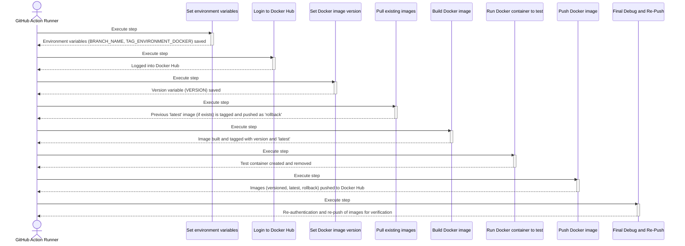

# Push to Docker Hub Action

## Languages
- [English](README.md)
- [Spanish](README.es.md)

### 📘 1. What does this Action do?

This GitHub Action automates the process of building a Docker image and publishing it to Docker Hub. Its main purpose is to standardize continuous deployment (CI/CD) by associating specific Git branches with Docker environment tags.

The workflow is as follows:

1. **Determine environment:** Identifies the Git branch that triggered the workflow (e.g., main, development) and maps it to an environment tag (e.g., prod, dev) using a configurable JSON map. If the branch is not in the map, the Action fails.

2. **Generate unique version:** Creates a unique version tag for the Docker image based on the current UTC date and time (e.g., 20231027T153000Z).

3. **Manage rollback:** Before building the new image, attempts to download the existing latest image for the corresponding environment. If found, it re-tags it as rollback and uploads it to Docker Hub, thus preserving a previous version for possible restorations.

4. **Build and test image:** Builds the new Docker image from a specific Dockerfile. Once built, tags it with the unique version and also as latest. Performs a quick smoke test by starting a container from the image and immediately removing it to verify it doesn't fail on startup.

5. **Publish to Docker Hub:** Uploads to Docker Hub the image with its unique version tag, the environment's latest tag, and the rollback tag (if created).

This Action is ideal for repositories that use an environment-based branch strategy (GitFlow or similar) and need an automated and consistent process for their Docker Hub deployments.

### ⚙️ 2. Required Inputs

Below are the input parameters that the Action uses:

| Input name | Required? | Default value | Technical description |
|------------|-----------|---------------|---------------------|
| `dockerhub-username` | ✅ | N/A | Username for Docker Hub authentication |
| `dockerhub-password` | ✅ | N/A | Password or access token for Docker Hub authentication |
| `dockerhub-repository` | ✅ | N/A | Docker Hub repository name where the image will be published (e.g., my-user/my-app) |
| `branch-environment-map` | ❌ | `{"main": "prod", "development": "dev", "staging": "stg", "testing": "tst"}` | JSON object that maps Git branch names to Docker environment tags |
| `dockerfile-path` | ❌ | `deployments/Dockerfile.deploy` | Relative path to the Dockerfile that will be used to build the image |

### 📈 3. Step-by-step Sequence Diagram

The following diagram illustrates the Action's execution flow, from initial configuration to final publication.



### 🧠 4. Detailed Algorithm

Below is a step-by-step description of the process that the Action performs:

#### Set environment variables

1. Extracts the current branch name from the `GITHUB_REF` environment variable and stores it in `BRANCH_NAME`.
2. Reads the `branch-environment-map` input (a JSON string) and uses the `jq` utility to find the value associated with the `BRANCH_NAME` key. The result is stored in `TAG_ENVIRONMENT_DOCKER`.
3. **Condition:** If no match is found for the branch in the map (`TAG_ENVIRONMENT_DOCKER` is null or empty), the script fails with error code 1.
4. Exports the `BRANCH_NAME` and `TAG_ENVIRONMENT_DOCKER` variables to the GitHub environment (`$GITHUB_ENV`) to make them available in subsequent steps.

#### Debug Environment Variables

- Prints the values of `TAG_ENVIRONMENT_DOCKER` and `BRANCH_NAME` variables for debugging purposes.

#### Login to Docker Hub

1. Uses the predefined `docker/login-action@v2` action.
2. Authenticates to Docker Hub using the `dockerhub-username` and `dockerhub-password` inputs.

#### Set Docker image version

1. Generates a text string with the current UTC date and time in `YYYYMMDDTHHMMSSZ` format and stores it in the `DATE_UTC` variable.
2. Exports this string as the `VERSION` variable to the GitHub environment (`$GITHUB_ENV`).

#### Debug Docker Version

- Prints the value of the `VERSION` variable.

#### Pull existing images

1. Executes the `docker pull` command to attempt downloading the image with the latest tag for the current environment (e.g., `my-repo:prod-latest`).
2. **Success Condition:** If the image downloads successfully:
   - Re-tags it with the `-rollback` suffix (e.g., `my-repo:prod-rollback`).
   - Pushes this new rollback image to Docker Hub with `docker push`.
3. **Failure Condition:** If no latest image exists, the command fails and displays a message indicating there's no image to use as rollback.

#### Build Docker image

1. Defines the complete name of the new image using the repository, environment tag, and version (`${{ inputs.dockerhub-repository }}:${TAG_ENVIRONMENT_DOCKER}-${VERSION}`) and stores it in `IMAGE_NAME`.
2. Exports `IMAGE_NAME` to the GitHub environment (`$GITHUB_ENV`).
3. Executes `docker build` using the Dockerfile specified in `dockerfile-path`.
4. Tags the newly built image with the complete `IMAGE_NAME`.
5. Additionally, tags it as `-latest` for the current environment (e.g., `my-repo:prod-latest`).

#### Debug Build Info

1. Prints the value of `IMAGE_NAME`.
2. Executes `docker images` to list all Docker images present in the runner.

#### Run Docker container to test

1. Executes `docker run` in detached mode (`-d`) to start a container named `test_container` from the newly built image (`$IMAGE_NAME`).
2. Lists all containers (`docker ps -a`) to verify their status.
3. Immediately afterward, forcefully stops and removes the `test_container` with `docker rm -f`.

#### Push Docker image

1. Executes `docker push` to upload the image with the unique version tag (`$IMAGE_NAME`).
2. Executes `docker push` to upload the image with the `-latest` tag for the environment.
3. **Condition:** Verifies if an image with the `-rollback` tag exists locally. If so, pushes it to Docker Hub.

#### Debug Info

1. Prints the value of `IMAGE_NAME` again.
2. Lists all local Docker images.
3. Performs a second `docker login` with the same credentials.
4. Re-executes `docker push` for the versioned image and latest image as a final verification measure.

### 🚀 5. Usage Examples

Here are example configurations for different scenarios.

#### Example 1: Production Deployment from main Branch

This example shows how to configure the workflow to build and publish an image to the production environment (prod) when pushing to the main branch.

##### Workflow Configuration
```yaml
name: Deploy to Production
on:
  push:
    branches:
      - main
jobs:
  build-and-push:
    runs-on: ubuntu-latest
    steps:
      - name: Checkout repository
        uses: actions/checkout@v3

      - name: Push to Docker Hub
        uses: ronihdzz/push-to-dockerhub-action@v2
        with:
          dockerhub-username: ${{ secrets.DOCKERHUB_USERNAME }}
          dockerhub-password: ${{ secrets.DOCKERHUB_TOKEN }}
          dockerhub-repository: ${{ secrets.DOCKERHUB_REPOSITORY }}
```

##### Behavior Explanation

- **Trigger**: The workflow runs when there's a push to the main branch.

- **Used Inputs**:
  - `dockerhub-username` and `dockerhub-password`: Obtained from repository secrets for secure authentication.
  - `dockerhub-repository`: Obtained from the `DOCKERHUB_REPOSITORY` secret to avoid exposing the repository name directly in the code.
  - `branch-environment-map`: Uses the default value. The Action will map the main branch to the prod environment.
  - `dockerfile-path`: Will use the default path: `deployments/Dockerfile.deploy`.

- **Result**: The Action will build an image and publish it to the repository defined in `secrets.DOCKERHUB_REPOSITORY` with the following tags:
  - `prod-latest` (the most recent image for production)
  - `prod-YYYYMMDDTHHMMSSZ` (a unique version tag)
  - `prod-rollback` (if a previous prod-latest image existed)

#### Example 2: Development Deployment with Custom Dockerfile

In this scenario, we want to deploy to the development environment (dev) from the development branch and use a Dockerfile located in a non-standard path.

##### Workflow Configuration
```yaml
name: Deploy to Development
on:
  push:
    branches:
      - development
jobs:
  build-and-push-dev:
    runs-on: ubuntu-latest
    steps:
      - name: Checkout repository
        uses: actions/checkout@v3

      - name: Push to Docker Hub (Dev)
        uses: ronihdzz/push-to-dockerhub-action@v2
        with:
          dockerhub-username: ${{ secrets.DOCKERHUB_USERNAME }}
          dockerhub-password: ${{ secrets.DOCKERHUB_TOKEN }}
          dockerhub-repository: ${{ secrets.DOCKERHUB_REPOSITORY }}
          dockerfile-path: 'build/dev/Dockerfile'
```

##### Behavior Explanation

- **Trigger**: The workflow runs with each push to the development branch.

- **Used Inputs**:
  - Credentials are provided from secrets.
  - `dockerhub-repository`: Also obtained from repository secrets, maintaining consistency.
  - `branch-environment-map`: Uses the default value. The Action will correctly map the development branch to the dev environment.
  - `dockerfile-path`: Overrides the default value to point to `build/dev/Dockerfile`.

- **Result**: The Action will use the specified Dockerfile to build the image. Then, it will publish it to the Docker Hub repository defined in the secrets with the tags `dev-latest`, `dev-YYYYMMDDTHHMMSSZ`, and potentially `dev-rollback`.

